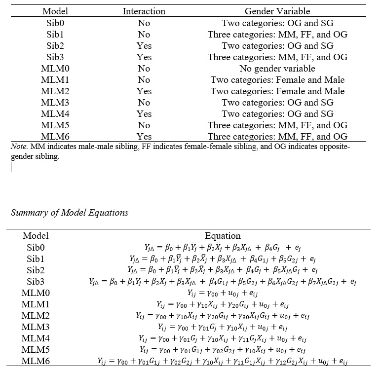
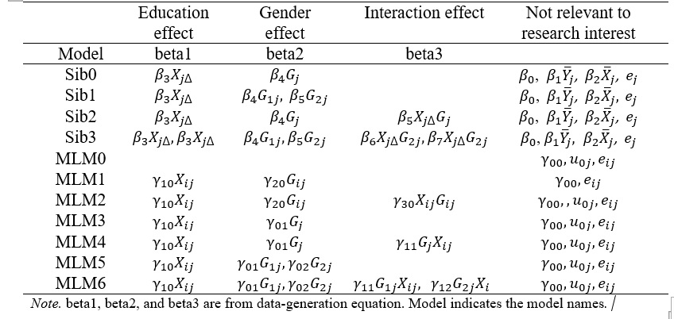

Model cheatsheet
================
Yoo Ri Hwang
2022-06-09

## Overview

This document presents eleven models that used in this project.

# Discordant kinship model

## sib0

= REG0

No interaction  
gender compositoin: mixed sex vs same sex

(y_diff \~ y_mean + con_mean + con_diff + gender_composition_two_eff,
data=dat3)

The coefficient in plots : meaning

con: continuous : education  
con_mean: education mean in sibling pair  
con_diff: education difference score in sibling pair  
gender composition two eff : mixed vs same sex (eff=effect coding)

## sib1

=REG1

no intearction gender composition = three level (mm, ff, mixed) because
this have three levels, we have two variables.

lm(y_diff \~ y_mean + con_mean + con_diff + ev1 + ev2, data=dat3) // ev
= effect code variable

The coefficient in plots : meaning

con: continuous : education  
con_mean: education mean in sibling pair  
con_diff: education difference score in sibling pair

gender composition variable (=ev1, ev2)

ev1 : effect code variable (mixed vs 11) 1/-1 is for male/femlae  
ev2 : effect code variable (mixed vs -1-1)

## sib2

=REG2 gender composition: two level (mixed vs same) interaction included

lm(y_diff \~ y_mean + con_mean + con_diff + gender_composition_two_eff +
gender_composition_two_eff:con_diff , data=data)

The coefficient in plots : meaning

con: continuous : education  
con_mean: education mean in sibling pair  
con_diff: education difference score in sibling pair  
gender composition two eff : mixed vs same sex (eff=effect coding)  
con_diffxgender_composition_two_eff : interaction between con_diff and
gender_composition_two_level

## sib3

REG3

gender compisition: three level (mm ff mixed)  
interaction included because this have three levels, we have two
variables.

sib_model\<- lm(y_diff \~ y_mean + con_mean + con_diff + ev1 + ev2 +
ev1*con_diff + ev2*con_diff, data=data)

The coefficient in plots : meaning

con: continuous : education  
con_mean: education mean in sibling pair  
con_diff: education difference score in sibling pair

gender composition variable (=ev1, ev2)

ev1 : effect code variable (mixed vs 11) 1/-1 is for male/femlae ev2 :
effect code variable (mixed vs -1-1)

con_diffxev1 : interaction between ev1 and education difference
con_diffxev2 : intearction between ev2 and education difference

# MLM

## MLM0

null model

## MLM1

MLM1: NO level 2 model without interaction

lmer(y\~1 + catwtn + con + (1\|pid), data=data)

y = health  
catwtn = cat within = gender within = individual gender  
con = education

## MLM2

MLM1: NO level 2 model with interaction

lmer(y\~1 + catwtn + con + catwtn\*con + (1\|pid), data=data)

extracted coefficient name version

y = health  
con = continuous = education  
catwtn = cat within = individual gender  
catwtnxcon = interaction between individual gender and education

## MLM3

level 2 variable: gender composition (mixed vs same)  
No interaction

lmer(y \~ 1 + con + catbtw + (1\|pid), data=data)

catbtw : gender composition : categorical between

## MLM4

gender composition: two level : mixed vs same  
with interaction

lmer(y \~ 1 + con + catbtw + con:catbtw + (1\|pid), data=data)

con: education  
catbtw: gender composition  
conxcatbtw : interaction between education and gender composition

### MLM5

gender composition : three levels (mm ff mixed )  
without interaction

lmer(y \~ 1 + con + ev1 + ev2 + (1\|pid), data=data)

con: education

since gender composition has three levels,  
effect coded variable should be two : ev1 and ev2

## MLM6

gender composition: three levels (mm ff mixed )  
with interaction

lmer(y \~ 1 + con + ev1 + ev2 + ev1:con + ev2:con + (1\|pid), data=data)

in extracted form,

conxev1 : interaction between continuous (edu) and ev1  
conxev2 : interaction between continuous (edu) and ev2

so, coef_fixed_conxev2_p\_MLM6

this variable means coeffcient, fixed effect, interaction between
continuous (edu) and ev2’s p-value in MLM6 model.

## 

SS = same sex sibling OS = opposite sex sibling mix = mixed sex sibling

# 
